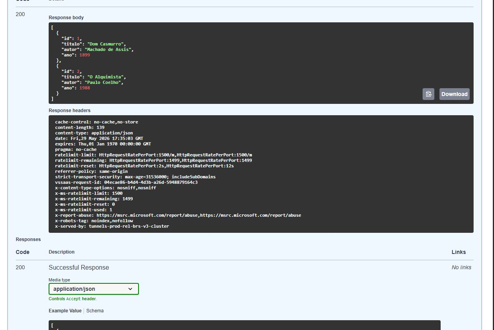
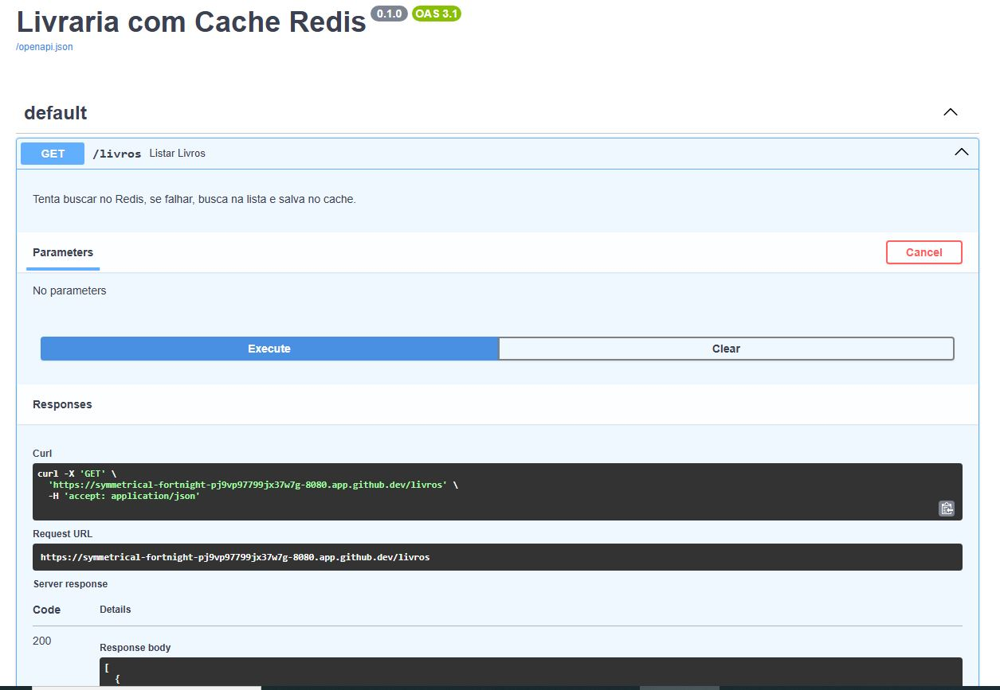
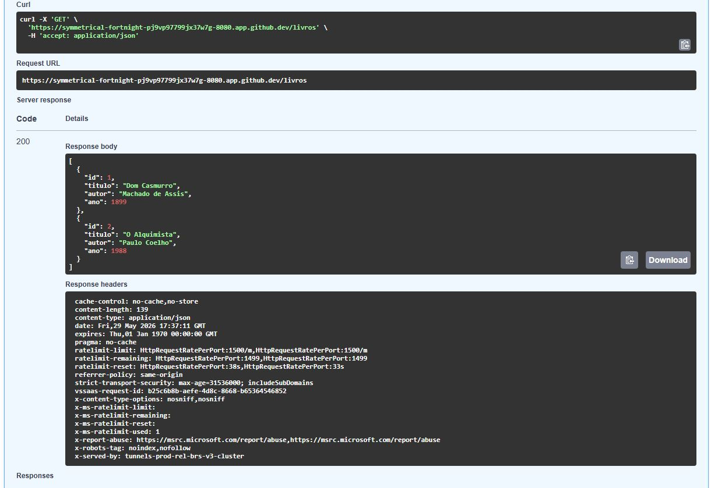
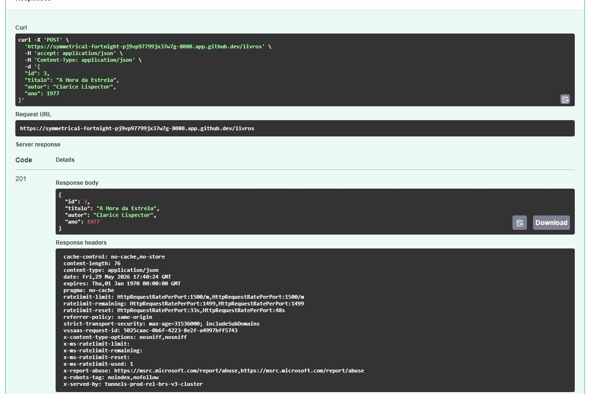
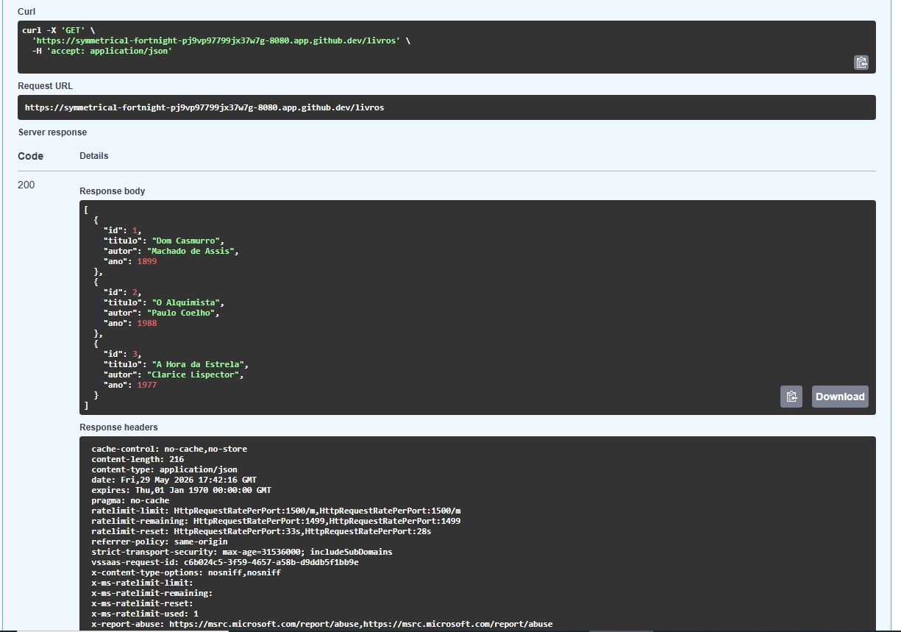

# 📚 API Livraria 3.0: Performance com Redis Cache, Orquestração Kubernetes & Observabilidade com ELK (Logstash)

Este projeto é uma evolução da API de Livros em FastAPI. O objetivo principal foi implementar uma camada de **Cache** utilizando o **Redis** para otimizar o tempo de resposta da listagem de livros, **orquestrar a aplicação completa em contêineres utilizando Kubernetes** para garantir alta disponibilidade e, por fim, integrar um pipeline de monitoramento e centralização de logs com o **Logstash (ELK Stack)**.

## 🛠️ Tecnologias e Conceitos

* **FastAPI**: Desenvolvimento de endpoints assíncronos.
* **Redis**: Armazenamento de dados em memória para cache rápido.
* **Cache-Aside Pattern & Invalidação**: Lógica para leitura e limpeza inteligente do cache.
* **Docker**: Conteinerização da aplicação FastAPI utilizando imagens leves (`python:3.10-slim`).
* **Kubernetes (K8s)**: Orquestração dos microsserviços.
* **Kind (Kubernetes in Docker)**: Ferramenta para execução do cluster local diretamente no **GitHub Codespaces**.
* **Logstash (ELK Stack)**: Coleta, filtragem com Grok e padronização dos logs gerados pela API.

---

## 🏗️ Arquitetura no Kubernetes & Observabilidade

A aplicação dentro do cluster foi dividida de forma resiliente e escalável:

* **FastAPI Deployment**: Configurado com **2 Réplicas (Pods)** rodando em paralelo para garantir que a API nunca fique fora do ar.
* **FastAPI Service (`ClusterIP`)**: Um ponto de entrada interno que distribui a carga entre as réplicas na porta `80`.
* **Redis Deployment & Service (`ClusterIP`)**: Uma instância isolada do Redis protegida na rede interna do cluster através do DNS estável `redis-service`.
* **Logstash Pipeline (Local/Docker)**: Escuta ativamente o arquivo estruturado de logs gerado pela aplicação (`app.log`), aplicando padrões Regex (Grok) para transformá-los em estruturas JSON prontas para o Elasticsearch.

### Prints dos Testes:






---

## ⚙️ Configuração do Ambiente e Execução (GitHub Codespaces)

Como o projeto está preparado para rodar no ambiente em nuvem do **Codespaces**, siga os passos abaixo no terminal integrado:

### 1. Inicializar o Cluster Kubernetes (Kind)
O Codespaces já vem com o Docker instalado. Execute os comandos abaixo para instalar o **Kind** e provisionar o cluster:

```bash
# Baixar e configurar o binário do Kind
curl -Lo ./kind [https://kind.sigs.k8s.io/dl/v0.20.0/kind-linux-amd64](https://kind.sigs.k8s.io/dl/v0.20.0/kind-linux-amd64)
chmod +x ./kind
sudo mv ./kind /usr/local/bin/kind

# Criar o cluster Kubernetes
kind create cluster --name meu-cluster
