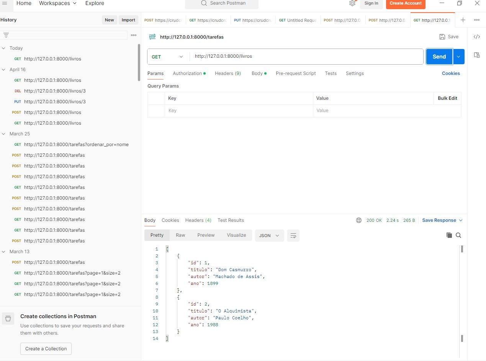
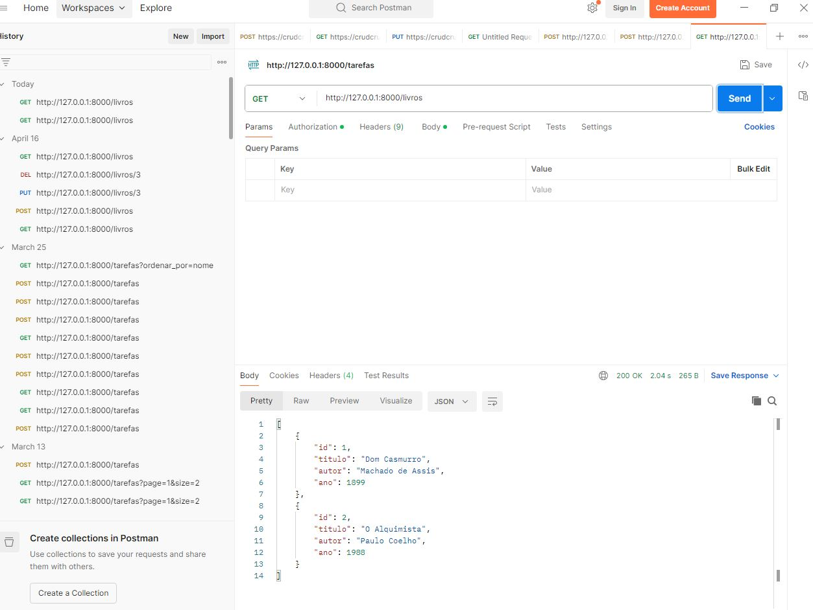
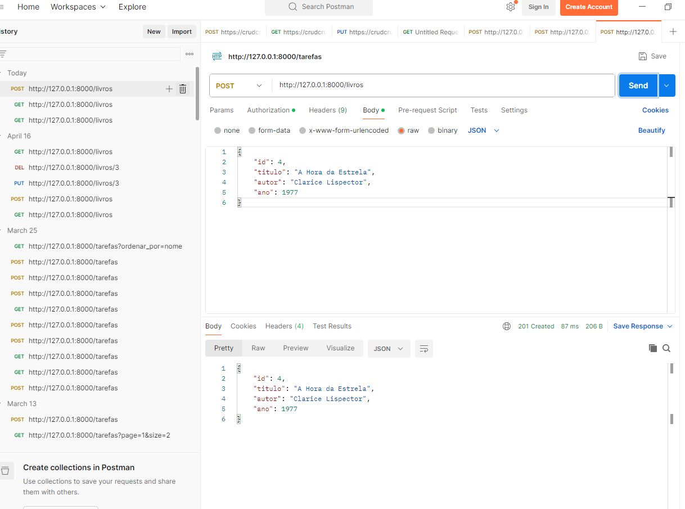
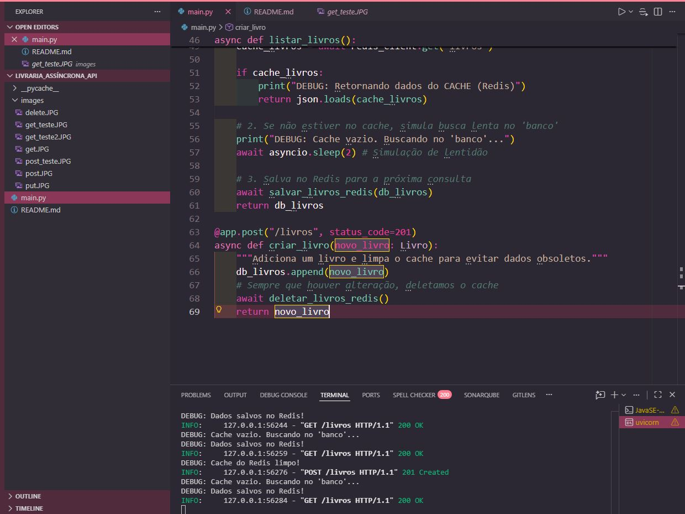

# 📚 API Livraria 2.0: Performance com Redis Cache

Este projeto é uma evolução da API de Livros em FastAPI. O objetivo principal foi implementar uma camada de **Cache** utilizando o **Redis** para otimizar o tempo de resposta da listagem de livros, reduzindo a carga no "banco de dados" e garantindo alta performance.

## 🛠️ Tecnologias e Conceitos

  * **FastAPI**: Desenvolvimento de endpoints assíncronos.
  * **Redis**: Armazenamento de dados em memória para cache rápido.
  * **Cache-Aside Pattern**: Lógica que verifica o cache antes de consultar a fonte de dados principal.
  * **Invalidação de Cache**: Garantia de que o cache seja limpo ao adicionar novos dados, evitando informações obsoletas.

-----

## ⚙️ Configuração do Ambiente (Windows)

### 1\. Preparar o Servidor Redis

Como esta versão não utiliza Docker, siga os passos abaixo:

1.  Baixe o Redis Portátil em: [Redis for Windows (GitHub)](https://github.com/tporadowski/redis/releases).
2.  Extraia o conteúdo e execute o arquivo `redis-server.exe`.
3.  **Mantenha a janela do terminal aberta** enquanto utiliza a API.

### 2\. Instalar Dependências Python

No seu terminal, instale as bibliotecas necessárias:

```bash
pip install fastapi uvicorn redis
```

### 3\. Executar a API

Inicie o servidor com o comando:

```bash
uvicorn main:app --reload
```

-----

## 🧪 Guia de Testes via Postman

Siga a sequência abaixo para validar o funcionamento do Cache:

### 1\. Listar Livros - Primeira Chamada (Cache Miss)

  * **Método:** `GET`
  * **URL:** `http://127.0.0.1:8000/livros`
  * **O que observar:** A resposta deve demorar cerca de 2 segundos (simulação de busca lenta).

> **Print do Teste (Observe o campo "Time" no canto direito):**

-----

### 2\. Listar Livros - Chamada Subsequente (Cache Hit)

  * **Ação:** Clique em **Send** novamente para o mesmo endpoint `GET`.
  * **O que observar:** A resposta será quase **instantânea** (menos de 50ms), pois os dados estão vindo do Redis.

> **Print do Teste (Observe a melhora no tempo de resposta):**

-----

### 3\. Cadastrar Livro (Invalidação de Cache)

  * **Método:** `POST`
  * **URL:** `http://127.0.0.1:8000/livros`
  * **Body (JSON):**
<!-- end list -->

```json
{
    "id": 5,
    "titulo": "A Hora da Estrela",
    "autor": "Clarice Lispector",
    "ano": 1977
}
```

  * **O que observar:** O sistema irá adicionar o livro e **apagar o cache antigo** no Redis.

> **Print do Teste (POST efetuado com sucesso):**


-----

### 4\. Validar Consistência

  * **Ação:** Faça um novo `GET /livros`.
  * **O que observar:** A chamada voltará a ser lenta uma única vez para atualizar o cache com o novo livro incluído.

-----

## 📝 Notas de Implementação

  * **Método `salvar_livros_redis`**: Converte a lista de objetos para JSON e armazena com um **TTL (Time To Live)** de 60 segundos.
  * **Método `deletar_livros_redis`**: Garante que o usuário nunca veja dados antigos após um cadastro.
  * **Conexão Assíncrona**: Utiliza `redis.asyncio` para não bloquear o loop de eventos da API.

-----